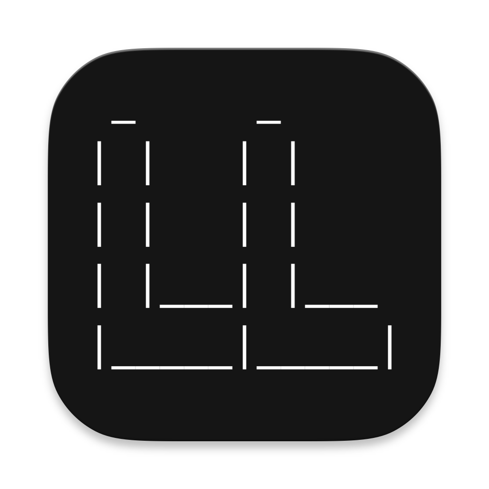

<div align="center">
  
  <h1>LLauncher</h1>
</div>

<p align="center">
  <strong>An open-source, cross-platform custom game runner.</strong>
</p>

<p align="center">
  <a href="https://github.com/tianqueal/llauncher-electron/releases">
    
  </a>
  <a href="https://github.com/tianqueal/llauncher-electron/blob/main/LICENSE">
    
  </a>
  <a href="https://github.com/tianqueal/llauncher-electron/actions/workflows/build.yml">
    
  </a>
</p>

---

**Important Disclaimer:** LLauncher is an unofficial, open-source project and is not affiliated with Mojang Studios or Microsoft Corporation. A legitimate copy of Minecraft Java Edition is required to use this launcher. LLauncher complies with Mojang’s End User Licence Agreement (EULA). No proprietary game files are included or distributed with this software. Playing the game without a valid account purchased from Mojang is not permitted.

---

LLauncher offers a simple and efficient way to manage and play your favourite game versions, built with modern technologies for a smooth user experience.

## ✨ Key Features

- **Cross-Platform:** Runs natively on Windows, macOS, and Linux.
- **Version Management:** Easily browse, select, and launch different game versions.
- **Modern UI:** A clean, intuitive, and responsive interface built with React and Tailwind CSS.
- **Customisable Settings:** Tailor your experience with various application settings.
- **Launch Monitoring:** Keep an eye on the game launch process with clear progress indicators.
- **Theme Support:** Adapts to your system's light or dark theme preferences.
- **Open Source:** Freedom to inspect, modify, and contribute to the project.

## 🛠️ Tech Stack

- **[Electron](https://www.electronjs.org/):** For building cross-platform desktop applications.
- **[React](https://reactjs.org/):** For building the user interface.
- **[TypeScript](https://www.typescriptlang.org/):** For robust, type-safe JavaScript development.
- **[Vite](https://vitejs.dev/):** For a fast and modern frontend build tooling experience.
- **[Tailwind CSS](https://tailwindcss.com/):** For a utility-first CSS framework.
- **[Electron Forge](https://www.electronforge.io/):** For packaging and distributing the Electron application.

## 🚀 Getting Started

### Prerequisites

- [Node.js](https://nodejs.org/) (v18 or newer recommended, v22 used in CI)
- [npm](https://www.npmjs.com/) (comes with Node.js)

### Installation & Development

1.  **Clone the repository:**

    ```bash
    git clone https://github.com/tianqueal/llauncher-electron.git
    cd llauncher-electron
    ```

2.  **Install dependencies:**

    ```bash
    npm install
    ```

3.  **Environment Variables:**

    For local development, LLauncher may require certain environment variables to be set, primarily for defining external resource URLs. These are **not hardcoded into the application** for security and flexibility reasons.

    Instead, create a `.env` file in the root of the project by copying the example file:

    ```bash
    cp .env.example .env
    ```

    Then, edit the newly created `.env` file with your specific local or development URLs.

    **`.env.example`:**

    ```dotenv
    # URLs for game manifests and assets - replace with your actual URLs for local dev
    ASSET_BASE_URL="YOUR_ASSET_BASE_URL_HERE"
    MANIFEST_URL="YOUR_MANIFEST_URL_HERE"
    PATCH_NOTES_BASE_URL="YOUR_PATCH_NOTES_BASE_URL_HERE"
    PATCH_NOTES_URL="YOUR_PATCH_NOTES_URL_HERE"
    VITE_PATCH_NOTES_BASE_URL="YOUR_VITE_PATCH_NOTES_BASE_URL_HERE"

    # Note: For production builds via GitHub Actions, these values are supplied
    # via Repository Variables/Secrets in the GitHub repository settings.
    # Do NOT commit your actual .env file with real values.
    ```

    Ensure your `.env` file is listed in your `.gitignore` file to prevent accidental commits. The application is configured to load these variables from the `.env` file during local development.

4.  **Run in development mode:**
    This will start the application with Vite's development server, enabling hot reloading.
    ```bash
    npm run start
    ```

## 📦 Building for Production

To create distributable packages for your operating system:

```bash
npm run make
```

This command utilises Electron Forge to build the application based on the configuration in `forge.config.ts`. The output will be located in the `out` directory.

### Important Note on Environment Variables for Local Production Builds

When building the application locally using `npm run make`, the Vite configuration for the main process (`vite.main.config.ts`) relies on specific environment variables (e.g., `ASSET_BASE_URL`, `MANIFEST_URL`) being present in `process.env` _at the time the Vite configuration is processed_.

The default `vite.main.config.ts` in this project **does not** include logic to automatically load variables from your `.env` file into `process.env` specifically for the `npm run make` command. This behaviour, where environment variables might not be automatically available to the Vite configuration during an Electron Forge `make` process, has been a point of discussion within the Electron Forge community (e.g., issue #3558 in the Electron Forge repository). Consequently, if you run `npm run make` without ensuring these variables are loaded, the resulting application may not function correctly as critical URLs will be undefined.

**To ensure your `.env` file is loaded for local `npm run make` builds:**

1.  Ensure you have a `.env` file at the root of your project containing the necessary environment variables (as described in the "Environment Variables" section under "Installation & Development").

2.  You will need to **modify your `vite.main.config.ts`** to explicitly load this `.env` file. A straightforward solution is to add the following code at the beginning of your `vite.main.config.ts`:

    ```typescript
    // vite.main.config.ts
    // ... existing imports ...
    import dotenv from 'dotenv'; // Add this import
    import path from 'node:path'; // Add this import

    // Add this block to load .env for the 'make' process
    const envPath = path.resolve(process.cwd(), '.env'); // Loads from your existing .env file
    const loadResult = dotenv.config({ path: envPath, override: true });

    if (loadResult.error) {
      console.error(
        `[vite.main.config.ts] CRITICAL: Error loading .env file from ${envPath}. This file is required for local 'npm run make' builds to correctly set up environment variables. Error: ${loadResult.error.message}`,
      );
      process.exit(1); // Exit if .env cannot be loaded
    } else {
      console.log(
        `[vite.main.config.ts] Successfully loaded environment variables from ${envPath} for the main process build.`,
      );
    }

    // Existing export default defineConfig...
    export default defineConfig(({ mode }) => {
      // ... rest of the configuration ...
      return {
        /* ... */
      };
    });
    ```

    With this modification, your existing `.env` file (used for local development with `npm run start`) will also be loaded when you run `npm run make`, ensuring the necessary variables are available.

**Note for CI (GitHub Actions):** In CI environments, these variables are typically injected directly into the build environment (e.g., via repository secrets). The `dotenv` loading block shown above, with its `process.exit(1)` on failure to load `.env`, would cause CI to fail if it couldn't find a `.env` file (which is expected as `.env` files should not be in source control). Therefore, CI environments rely on direct injection of environment variables, and this specific modification to `vite.main.config.ts` is primarily for ensuring consistent local builds. If you need `vite.main.config.ts` to be compatible with both local `.env` loading and CI direct injection without modification, a more nuanced loading logic would be required.

## 🤝 Contributing

Contributions are welcome! Whether it's bug reports, feature suggestions, or code contributions, please feel free to open an issue or submit a pull request.

1.  Fork the Project
2.  Create your Feature Branch (`git checkout -b feature/AmazingFeature`)
3.  Commit your Changes (`git commit -m 'Add some AmazingFeature'`)
4.  Push to the Branch (`git push origin feature/AmazingFeature`)
5.  Open a Pull Request

Please ensure your code adheres to the project's linting and formatting standards:

```bash
npm run lint
npm run format # To automatically format
npm run format:check # To check formatting
```

## 📜 Licence

This project is licensed under the MIT Licence - see the [LICENSE](LICENSE) file for details.

---

<p align="center">
  Happy gaming!
</p>
